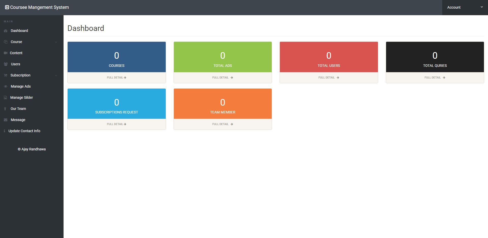
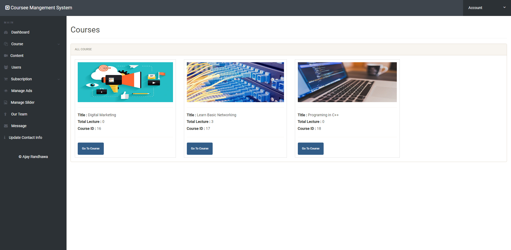

# Course-Mangement-System
Learning Management System Project In PHP is a project created using PHP programming language that can be used in a classroom based setup. Wherein, the instructor can only upload the module or topic to the system and the student can only interact with the system and follow the instructions in the module set by the instructors.

## Features

1. Create and Mange Courses
2. Upload Course Content
3. Manage Users 
4. Add Video File or Document in Course
5. Messages
6. Manage Slider
7. Manage Ads
8. Manage Subscription

Author : Ajay Randhawa
